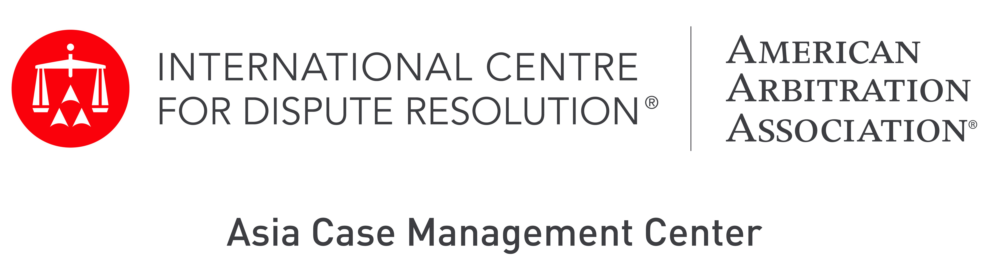
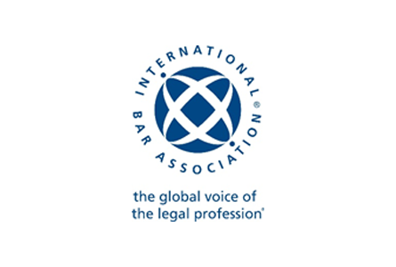
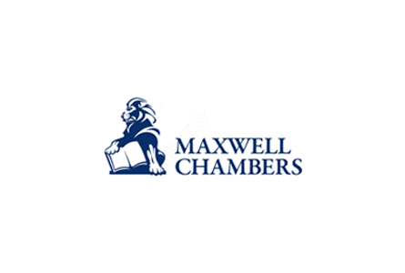
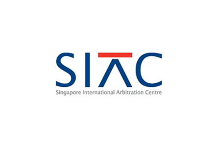
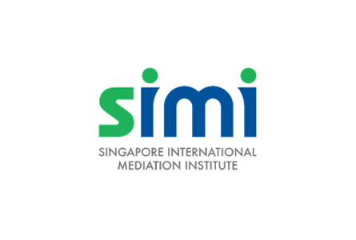

### **Organisers**

#### **Singapore Ministry of Law** 

The mission of the Singapore Ministry of Law (MinLaw) is to advance access to justice, the rule of law, the economy and society through policy, law and services.

MinLaw drives legal reforms, oversees the policy for the development, promotion and regulation of Singapore’s legal sector, and advances Singapore’s national interests through international legal policy and cooperation.

In addition, MinLaw licences law practices, registers foreign-qualified legal practitioners, regulates moneylending and pawnbroking, supervises precious stones and metal dealers, and provides community legal services such as legal aid, community mediation, insolvency administration, and public trustee services.

MinLaw also oversees land policy and administration, and the development of Singapore’s intellectual property sector supported by its statutory boards.

For more information, please visit MinLaw’s [website](https://www.mlaw.gov.sg){:target="_blank"}.

#### **UNCITRAL**
The United Nations Commission on International Trade and Law is the core legal body of the United Nations system in the field of international trade law. A legal body with universal membership specialising in commercial law reform worldwide for over 50 years, UNCITRAL's business is the modernisation and harmonisation of rules on international business.

* [Guide to UNCITRAL: Basic facts about the United Nations Commission on International Trade Law](https://uncitral.un.org/sites/uncitral.un.org/files/media-documents/uncitral/en/12-57491-guide-to-uncitral-e.pdf){:target="_blank"}

* [Facts about UNCITRAL](https://uncitral.un.org/sites/uncitral.un.org/files/media-documents/uncitral/en/uncitral-leaflet-e.pdf){:target="_blank"}   

For more information, please visit UNCITRAL’s website, [here](https://uncitral.un.org/en){:target="_blank"}.

### **Supporting Organisers**

    
